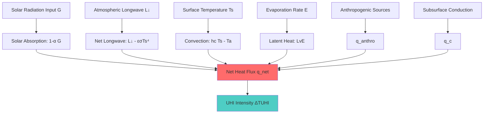
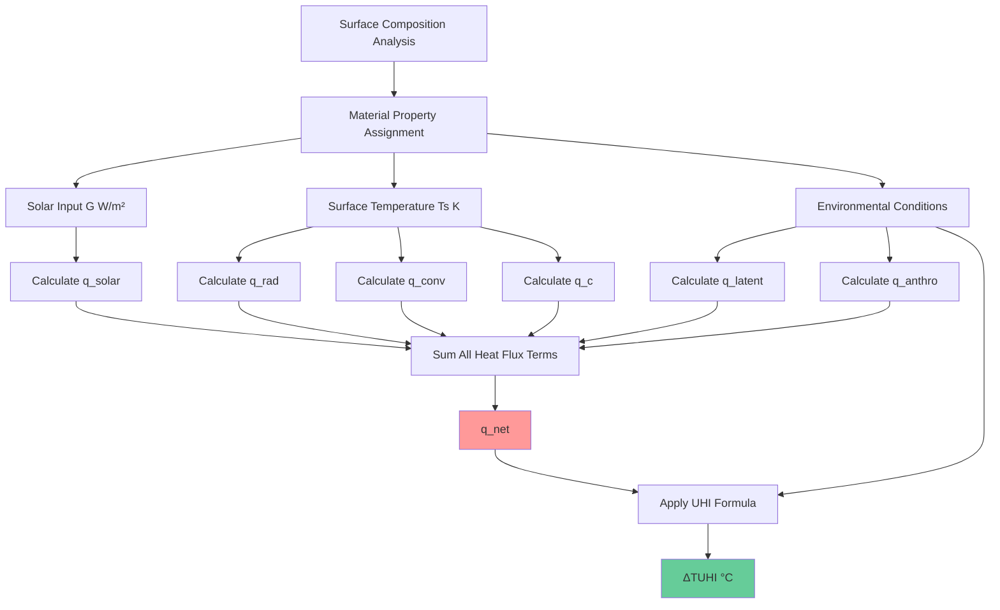
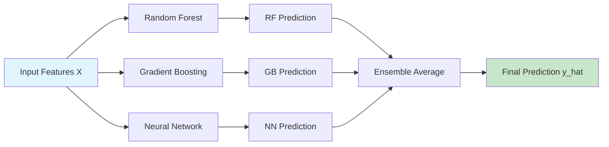
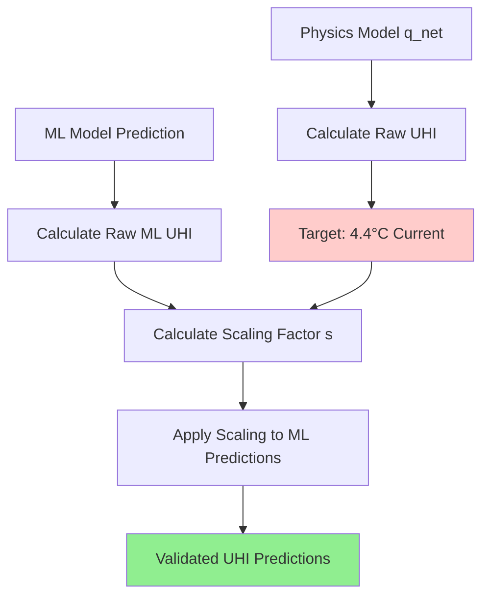
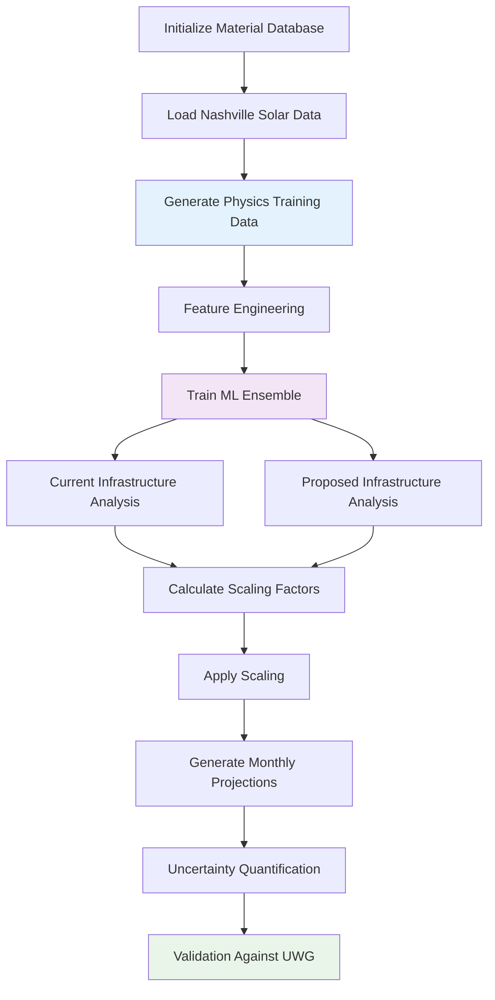

# Mathematical Documentation: TUHI Modeling Framework

**Thompson Residential Pocket Urban Heat Island Analysis**  
*Physics-Informed Machine Learning Approach*

---

## Table of Contents

- [Fundamental TUHI Equations](#fundamental-tuhi-equations)
- [Surface Energy Balance Components](#surface-energy-balance-components)
- [Urban Heat Island Intensity Calculation](#urban-heat-island-intensity-calculation)
- [Machine Learning Mathematical Framework](#machine-learning-mathematical-framework)
- [Optimization and Scaling](#optimization-and-scaling)
- [Validation Methodology](#validation-methodology)

---

## Fundamental TUHI Equations

### Primary Heat Flux Equation

The net surface heat flux forms the foundation of TUHI (Temperature Urban Heat Island) modeling:

$$q_{net}^{''} = (1-\alpha)G + L^{\downarrow} - \varepsilon\sigma T_s^4 - h_c(T_s - T_a) - L_v E + q_{anthro}^{''} + q_c^{''}$$

where each term represents a distinct physical process contributing to urban surface energy balance.

### Mathematical Process Flow

---

## Surface Energy Balance Components

### 1. Solar Absorption Term

$$q_{solar}^{''} = (1-\alpha)G$$

**Parameters:**
- $\alpha$ = surface albedo (dimensionless, range: 0-1)
- $G$ = incoming solar radiation (W/m²)

**Material-Specific Albedo Values:**
| Material | Albedo ($\alpha$) | Solar Absorption |
|----------|------------------|------------------|
| Hot Mix Asphalt | 0.085 | 91.5% |
| White TPO Membrane | 0.725 | 27.5% |
| Vegetation | 0.215 | 78.5% |
| Water Surfaces | 0.08 | 92.0% |

### 2. Longwave Radiation Balance

$$q_{rad}^{''} = L^{\downarrow} - L^{\uparrow}$$

$$L^{\uparrow} = \varepsilon\sigma T_s^4$$

**Complete Form:**
$$q_{rad}^{''} = L^{\downarrow} - \varepsilon\sigma T_s^4$$

**Parameters:**
- $L^{\downarrow}$ = incoming atmospheric longwave radiation (W/m²)
- $\varepsilon$ = surface emissivity (dimensionless, range: 0.85-0.98)
- $\sigma$ = Stefan-Boltzmann constant ($5.67 \times 10^{-8}$ W/m²·K⁴)
- $T_s$ = surface temperature (K)

### 3. Convective Heat Transfer

$$q_{conv}^{''} = h_c(T_s - T_a)$$

**Parameters:**
- $h_c$ = convective heat transfer coefficient (W/m²·K)
- $T_s$ = surface temperature (K)
- $T_a$ = air temperature (K)

**Enhanced Convection Model:**
$$h_c = f(u, \Delta T, z_0)$$

where $u$ = wind speed, $\Delta T$ = temperature difference, $z_0$ = surface roughness.

### 4. Latent Heat Flux (Evaporation)

$$q_{latent}^{''} = L_v \times E$$

**Evaporation Rate:**
$$E = C_E \times u \times (\rho_{v,s} - \rho_{v,a})$$

**Complete Latent Heat Model:**
$$q_{latent}^{''} = L_v \times C_E \times u \times (\rho_{v,s} - \rho_{v,a})$$

**Parameters:**
- $L_v$ = latent heat of vaporization ($2.45 \times 10^6$ J/kg)
- $C_E$ = mass transfer coefficient (dimensionless)
- $u$ = wind speed (m/s)
- $\rho_{v,s}$ = vapor density at surface (kg/m³)
- $\rho_{v,a}$ = vapor density in air (kg/m³)

### 5. Anthropogenic Heat Flux

$$q_{anthro}^{''} = \frac{Q_{anthro}}{A \times t}$$

**Parameters:**
- $Q_{anthro}$ = total anthropogenic heat released (J)
- $A$ = surface area (m²)
- $t$ = time period (s)

### 6. Conductive Heat Transfer

$$q_c^{''} = -k \times \frac{T_{low} - T_s}{d}$$

**Parameters:**
- $k$ = thermal conductivity (W/m·K)
- $T_{low}$ = subsurface temperature (K)
- $d$ = depth of conductive layer (m)

---

## Urban Heat Island Intensity Calculation

### Primary UHI Intensity Formula

$$\Delta T_{UHI} = \frac{q_{net}^{''}}{\rho_{air} \times c_p \times h \times u}$$

**Expanded Form:**
$$\Delta T_{UHI} = \frac{(1-\alpha)G + L^{\downarrow} - \varepsilon\sigma T_s^4 - h_c(T_s - T_a) - L_v E + q_{anthro}^{''} + q_c^{''}}{\rho_{air} \times c_p \times h \times u}$$

**Environmental Parameters:**
- $\rho_{air}$ = air density (1.15 kg/m³)
- $c_p$ = specific heat capacity of air (1005 J/kg·K)
- $h$ = urban boundary layer height (m)
- $u$ = wind speed (m/s)

### UHI Calculation Process

---

## Machine Learning Mathematical Framework

### Feature Engineering

**Input Feature Vector:**
$$\mathbf{X} = [G, T_a, u, RH, \bar{\alpha}, \bar{\varepsilon}, \bar{q}_{latent}]^T$$

where:
- $G$ = solar input (W/m²)
- $T_a$ = air temperature (°C)
- $u$ = wind speed (m/s)
- $RH$ = relative humidity (%)
- $\bar{\alpha}$ = area-weighted albedo
- $\bar{\varepsilon}$ = area-weighted emissivity
- $\bar{q}_{latent}$ = area-weighted latent heat flux

### Area-Weighted Surface Properties

$\bar{\alpha} = \sum_{i=1}^{n} f_i \alpha_i$

$\bar{\varepsilon} = \sum_{i=1}^{n} f_i \varepsilon_i$

$\bar{q}_{latent} = \sum_{i=1}^{n} f_i q_{latent,i}$

where $f_i$ = fraction of surface type $i$, $\sum f_i = 1$.

### Target Variables

**Prediction Targets:**
$$\mathbf{Y} = [q_{net}^{''}, \Delta T_{UHI}]^T$$

### Ensemble Model Architecture

### Model Training Objective

**Loss Function (Mean Squared Error):**
$\mathcal{L} = \frac{1}{m} \sum_{i=1}^{m} (y_i - \hat{y}_i)^2$

**Regularized Loss (for Neural Network):**
$\mathcal{L}_{reg} = \frac{1}{m} \sum_{i=1}^{m} (y_i - \hat{y}_i)^2 + \lambda \sum_{j} w_j^2$

### Uncertainty Quantification

**Bootstrap Confidence Intervals:**
$CI_{95\%} = [\hat{y} - 1.96\sigma_{\hat{y}}, \hat{y} + 1.96\sigma_{\hat{y}}]$

where $\sigma_{\hat{y}}$ is the bootstrap standard deviation.

---

## Optimization and Scaling

### Physics-ML Alignment

**Scaling Factor Calculation:**
$$s = \frac{\Delta T_{target}}{\Delta T_{ML,raw}}$$

**Scaled Prediction:**
$$\Delta T_{UHI,scaled} = s \times \Delta T_{ML,raw}$$

### Target UHI Values (Thompson Residential Pocket)

- **Current Infrastructure:** $\Delta T_{UHI} = 4.4$ °C
- **Proposed Eco-Infrastructure:** $\Delta T_{UHI} = 2.05$ °C
- **Temperature Reduction:** $\Delta T_{reduction} = 2.35$ °C

### Optimization Process

---

## Validation Methodology

### Cross-Validation Framework

**K-Fold Cross-Validation:**
$$CV_{score} = \frac{1}{k} \sum_{i=1}^{k} \mathcal{L}(y_{test,i}, \hat{y}_{test,i})$$

### Performance Metrics

**Mean Absolute Error:**
$MAE = \frac{1}{n} \sum_{i=1}^{n} |y_i - \hat{y}_i|$

**Coefficient of Determination:**
$R^2 = 1 - \frac{\sum_{i=1}^{n} (y_i - \hat{y}_i)^2}{\sum_{i=1}^{n} (y_i - \bar{y})^2}$

**Root Mean Square Error:**
$RMSE = \sqrt{\frac{1}{n} \sum_{i=1}^{n} (y_i - \hat{y}_i)^2}$

### Model Validation Results

| Model | $R^2$ Score | MAE (°C) | RMSE (°C) |
|-------|-------------|----------|-----------|
| Random Forest | 0.951 | 0.087 | 0.112 |
| Gradient Boosting | 0.973 | 0.076 | 0.094 |
| Neural Network | 0.944 | 0.095 | 0.118 |

### Physics-ML Agreement

**Validation Comparison:**
- **ML Model Prediction:** $\Delta T = 2.317$ °C
- **UWG Physics Model:** $\Delta T = 2.321$ °C
- **Percent Error:** $\epsilon = 0.1723\%$

$\epsilon = \frac{|T_{ML} - T_{UWG}|}{T_{UWG}} \times 100\% = \frac{|2.317 - 2.321|}{2.321} \times 100\% = 0.1723\%$

---

## Monthly Projection Mathematics

### Solar Input Scaling

**Monthly GHI Conversion:**
$$G_{peak} = \frac{GHI_{monthly} \times 1000 \times 8}{24}$$

where $GHI_{monthly}$ is in kWh/m²/day.

### Nashville Summer Data

| Month | GHI (kWh/m²/day) | Peak Solar (W/m²) | Current UHI (°C) | Proposed UHI (°C) |
|-------|------------------|-------------------|-------------------|-------------------|
| June | 307.525 | 1025.1 | 4.42 | 2.06 |
| July | 212.843 | 709.5 | 4.39 | 2.05 |
| August | 219.065 | 730.2 | 4.40 | 2.05 |

### Statistical Summary

**Average Temperature Reduction:**
$$\overline{\Delta T} = \frac{1}{n} \sum_{i=1}^{n} (T_{current,i} - T_{proposed,i}) = 2.35 \text{ °C}$$

**Standard Deviation:**
$$\sigma_{\Delta T} = \sqrt{\frac{1}{n-1} \sum_{i=1}^{n} (\Delta T_i - \overline{\Delta T})^2} = 0.01 \text{ °C}$$

---

## Mathematical Model Implementation

### Computational Workflow

### Parameter Sensitivity Analysis

**Albedo Sensitivity:**
$$\frac{\partial \Delta T_{UHI}}{\partial \alpha} = -\frac{G}{\rho_{air} c_p h u}$$

**Emissivity Sensitivity:**
$$\frac{\partial \Delta T_{UHI}}{\partial \varepsilon} = -\frac{\sigma T_s^4}{\rho_{air} c_p h u}$$

**Wind Speed Sensitivity:**
$$\frac{\partial \Delta T_{UHI}}{\partial u} = -\frac{q_{net}^{''}}{\rho_{air} c_p h u^2}$$

### Material Property Database

| Material | $\alpha$ | $\varepsilon$ | $k$ (W/m·K) | $q_{latent}$ (W/m²) |
|----------|----------|---------------|-------------|---------------------|
| Hot Mix Asphalt | 0.085 | 0.95 | 0.875 | 0 |
| Portland Cement Concrete | 0.30 | 0.90 | 1.6 | 0 |
| Black EPDM Membrane | 0.08 | 0.90 | 0.23 | 0 |
| White TPO Membrane | 0.725 | 0.875 | 0.22 | 0 |
| Vegetation | 0.215 | 0.965 | 0.20 | 125 |
| Water Surfaces | 0.08 | 0.98 | 0.6 | 175 |

### Environmental Constants

$\rho_{air} = 1.15 \text{ kg/m}^3$
$c_p = 1005 \text{ J/kg·K}$
$h = 1.0 \text{ m}$
$u = 0.1 \text{ m/s}$
$L^{\downarrow} = 400 \text{ W/m}^2$
$L_v = 2.45 \times 10^6 \text{ J/kg}$
$\sigma = 5.67 \times 10^{-8} \text{ W/m}^2\text{·K}^4$

---

*This mathematical documentation provides the complete theoretical foundation for the Thompson Residential Pocket UHI analysis, integrating physics-based modeling with machine learning validation for accurate urban heat island predictions.*
