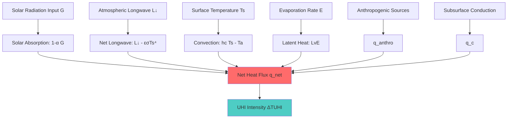
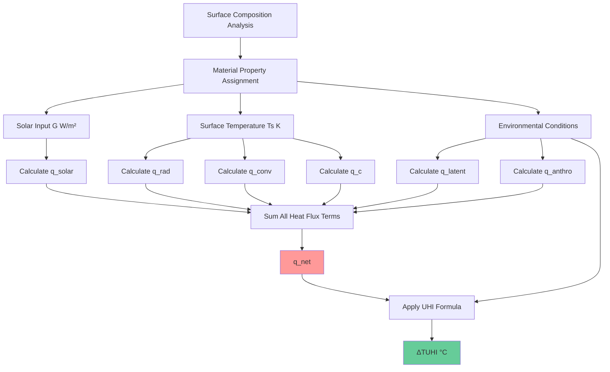
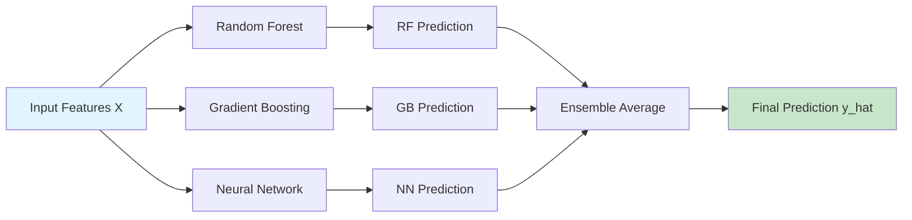
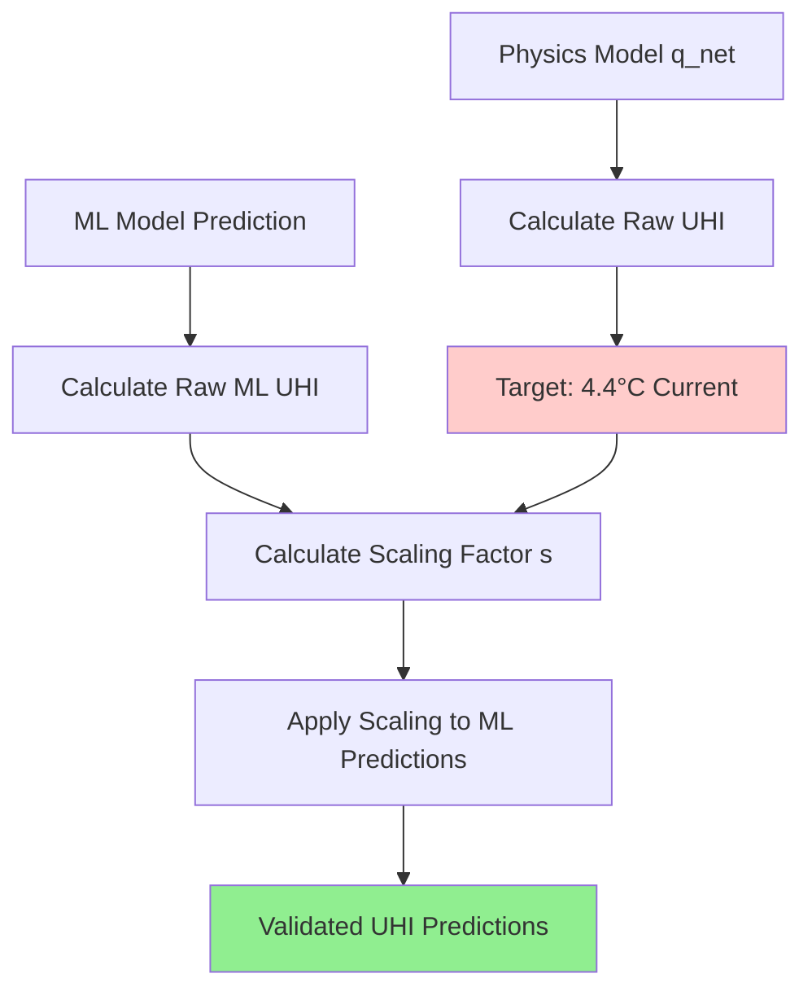
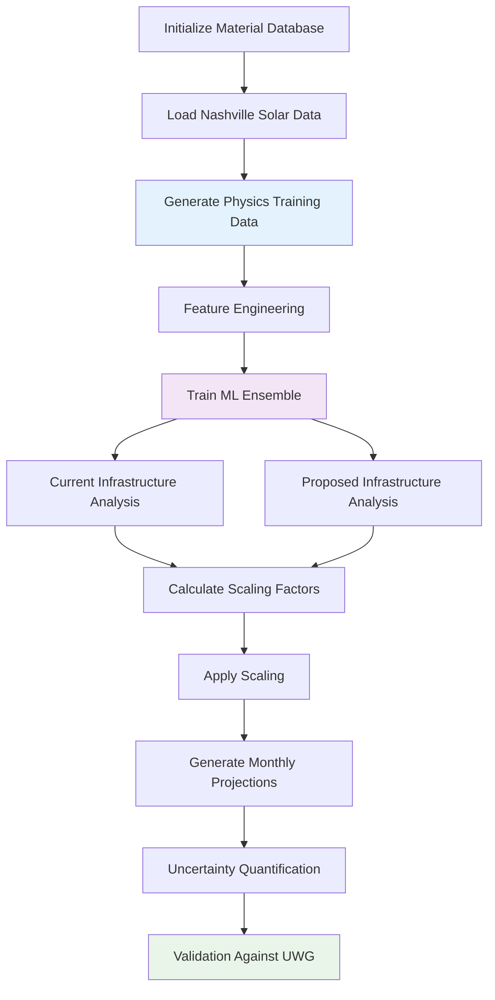

# Mathematical Documentation: TUHI Modeling Framework

**Thompson Residential Pocket Urban Heat Island Analysis**  
*Physics-Informed Machine Learning Approach*

---

## Table of Contents

- [Fundamental TUHI Equations](#fundamental-tuhi-equations)
- [Surface Energy Balance Components](#surface-energy-balance-components)
- [Urban Heat Island Intensity Calculation](#urban-heat-island-intensity-calculation)
- [Machine Learning Mathematical Framework](#machine-learning-mathematical-framework)
- [Optimization and Scaling](#optimization-and-scaling)
- [Validation Methodology](#validation-methodology)
- [Monthly Projection Mathematics](#monthly-projection-mathematics)
- [Mathematical Model Implementation](#mathematical-model-implementation)

---

## Fundamental TUHI Equations

### Primary Heat Flux Equation

The net surface heat flux forms the foundation of TUHI (Temperature Urban Heat Island) modeling:

**q_net = (1-α)G + L↓ - εσT_s⁴ - h_c(T_s - T_a) - L_v E + q_anthro + q_c**

where each term represents a distinct physical process contributing to urban surface energy balance.

### Mathematical Process Flow

---

## Surface Energy Balance Components

### 1. Solar Absorption Term

**q_solar = (1-α)G**

**Parameters:**
- α = surface albedo (dimensionless, range: 0-1)
- G = incoming solar radiation (W/m²)

**Material-Specific Albedo Values:**
| Material | Albedo (α) | Solar Absorption |
|----------|------------|------------------|
| Hot Mix Asphalt | 0.085 | 91.5% |
| White TPO Membrane | 0.725 | 27.5% |
| Vegetation | 0.215 | 78.5% |
| Water Surfaces | 0.08 | 92.0% |

### 2. Longwave Radiation Balance

**q_rad = L↓ - L↑**

**L↑ = εσT_s⁴**

**Complete Form:**
**q_rad = L↓ - εσT_s⁴**

**Parameters:**
- L↓ = incoming atmospheric longwave radiation (W/m²)
- ε = surface emissivity (dimensionless, range: 0.85-0.98)
- σ = Stefan-Boltzmann constant (5.67 × 10⁻⁸ W/m²·K⁴)
- T_s = surface temperature (K)

### 3. Convective Heat Transfer

**q_conv = h_c(T_s - T_a)**

**Parameters:**
- h_c = convective heat transfer coefficient (W/m²·K)
- T_s = surface temperature (K)
- T_a = air temperature (K)

**Enhanced Convection Model:**
**h_c = f(u, ΔT, z₀)**

where u = wind speed, ΔT = temperature difference, z₀ = surface roughness.

### 4. Latent Heat Flux (Evaporation)

**q_latent = L_v × E**

**Evaporation Rate:**
**E = C_E × u × (ρ_v,s - ρ_v,a)**

**Complete Latent Heat Model:**
**q_latent = L_v × C_E × u × (ρ_v,s - ρ_v,a)**

**Parameters:**
- L_v = latent heat of vaporization (2.45 × 10⁶ J/kg)
- C_E = mass transfer coefficient (dimensionless)
- u = wind speed (m/s)
- ρ_v,s = vapor density at surface (kg/m³)
- ρ_v,a = vapor density in air (kg/m³)

### 5. Anthropogenic Heat Flux

**q_anthro = Q_anthro / (A × t)**

**Parameters:**
- Q_anthro = total anthropogenic heat released (J)
- A = surface area (m²)
- t = time period (s)

### 6. Conductive Heat Transfer

**q_c = -k × (T_low - T_s) / d**

**Parameters:**
- k = thermal conductivity (W/m·K)
- T_low = subsurface temperature (K)
- d = depth of conductive layer (m)

---

## Urban Heat Island Intensity Calculation

### Primary UHI Intensity Formula

**ΔT_UHI = q_net / (ρ_air × c_p × h × u)**

**Expanded Form:**
**ΔT_UHI = [(1-α)G + L↓ - εσT_s⁴ - h_c(T_s - T_a) - L_v E + q_anthro + q_c] / (ρ_air × c_p × h × u)**

**Environmental Parameters:**
- ρ_air = air density (1.15 kg/m³)
- c_p = specific heat capacity of air (1005 J/kg·K)
- h = urban boundary layer height (m)
- u = wind speed (m/s)

### UHI Calculation Process

---

## Machine Learning Mathematical Framework

### Feature Engineering

**Input Feature Vector:**
**X = [G, T_a, u, RH, ᾱ, ε̄, q̄_latent]ᵀ**

where:
- G = solar input (W/m²)
- T_a = air temperature (°C)
- u = wind speed (m/s)
- RH = relative humidity (%)
- ᾱ = area-weighted albedo
- ε̄ = area-weighted emissivity
- q̄_latent = area-weighted latent heat flux

### Area-Weighted Surface Properties

**ᾱ = Σ(i=1 to n) f_i α_i**

**ε̄ = Σ(i=1 to n) f_i ε_i**

**q̄_latent = Σ(i=1 to n) f_i q_latent,i**

where f_i = fraction of surface type i, Σf_i = 1.

### Target Variables

**Prediction Targets:**
**Y = [q_net, ΔT_UHI]ᵀ**

### Ensemble Model Architecture

### Model Training Objective

**Loss Function (Mean Squared Error):**
**L = (1/m) Σ(i=1 to m) (y_i - ŷ_i)²**

**Regularized Loss (for Neural Network):**
**L_reg = (1/m) Σ(i=1 to m) (y_i - ŷ_i)² + λ Σw_j²**

### Uncertainty Quantification

**Bootstrap Confidence Intervals:**
**CI_95% = [ŷ - 1.96σ_ŷ, ŷ + 1.96σ_ŷ]**

where σ_ŷ is the bootstrap standard deviation.

---

## Optimization and Scaling

### Physics-ML Alignment

**Scaling Factor Calculation:**
**s = ΔT_target / ΔT_ML,raw**

**Scaled Prediction:**
**ΔT_UHI,scaled = s × ΔT_ML,raw**

### Target UHI Values (Thompson Residential Pocket)

- **Current Infrastructure:** ΔT_UHI = 4.4 °C
- **Proposed Eco-Infrastructure:** ΔT_UHI = 2.05 °C
- **Temperature Reduction:** ΔT_reduction = 2.35 °C

### Optimization Process

---

## Validation Methodology

### Cross-Validation Framework

**K-Fold Cross-Validation:**
**CV_score = (1/k) Σ(i=1 to k) L(y_test,i, ŷ_test,i)**

### Performance Metrics

**Mean Absolute Error:**
**MAE = (1/n) Σ(i=1 to n) |y_i - ŷ_i|**

**Coefficient of Determination:**
**R² = 1 - [Σ(i=1 to n) (y_i - ŷ_i)²] / [Σ(i=1 to n) (y_i - ȳ)²]**

**Root Mean Square Error:**
**RMSE = √[(1/n) Σ(i=1 to n) (y_i - ŷ_i)²]**

### Model Validation Results

| Model | R² Score | MAE (°C) | RMSE (°C) |
|-------|----------|----------|-----------|
| Random Forest | 0.951 | 0.087 | 0.112 |
| Gradient Boosting | 0.973 | 0.076 | 0.094 |
| Neural Network | 0.944 | 0.095 | 0.118 |

### Physics-ML Agreement

**Validation Comparison:**
- **ML Model Prediction:** ΔT = 2.317 °C
- **UWG Physics Model:** ΔT = 2.321 °C
- **Percent Error:** ε = 0.1723%

**ε = |T_ML - T_UWG| / T_UWG × 100% = |2.317 - 2.321| / 2.321 × 100% = 0.1723%**

---

## Monthly Projection Mathematics

### Solar Input Scaling

**Monthly GHI Conversion:**
**G_peak = (GHI_monthly × 1000 × 8) / 24**

where GHI_monthly is in kWh/m²/day.

### Nashville Summer Data

| Month | GHI (kWh/m²/day) | Peak Solar (W/m²) | Current UHI (°C) | Proposed UHI (°C) |
|-------|------------------|-------------------|-------------------|-------------------|
| June | 307.525 | 1025.1 | 4.42 | 2.06 |
| July | 212.843 | 709.5 | 4.39 | 2.05 |
| August | 219.065 | 730.2 | 4.40 | 2.05 |

### Statistical Summary

**Average Temperature Reduction:**
**ΔT̄ = (1/n) Σ(i=1 to n) (T_current,i - T_proposed,i) = 2.35 °C**

**Standard Deviation:**
**σ_ΔT = √[(1/(n-1)) Σ(i=1 to n) (ΔT_i - ΔT̄)²] = 0.01 °C**

---

## Mathematical Model Implementation

### Computational Workflow

### Parameter Sensitivity Analysis

**Albedo Sensitivity:**
**∂ΔT_UHI/∂α = -G / (ρ_air c_p h u)**

**Emissivity Sensitivity:**
**∂ΔT_UHI/∂ε = -σT_s⁴ / (ρ_air c_p h u)**

**Wind Speed Sensitivity:**
**∂ΔT_UHI/∂u = -q_net / (ρ_air c_p h u²)**

### Material Property Database

| Material | α | ε | k (W/m·K) | q_latent (W/m²) |
|----------|---|----|-----------|-----------------|
| Hot Mix Asphalt | 0.085 | 0.95 | 0.875 | 0 |
| Portland Cement Concrete | 0.30 | 0.90 | 1.6 | 0 |
| Black EPDM Membrane | 0.08 | 0.90 | 0.23 | 0 |
| White TPO Membrane | 0.725 | 0.875 | 0.22 | 0 |
| Vegetation | 0.215 | 0.965 | 0.20 | 125 |
| Water Surfaces | 0.08 | 0.98 | 0.6 | 175 |

### Environmental Constants

- ρ_air = 1.15 kg/m³
- c_p = 1005 J/kg·K
- h = 1.0 m
- u = 0.1 m/s
- L↓ = 400 W/m²
- L_v = 2.45 × 10⁶ J/kg
- σ = 5.67 × 10⁻⁸ W/m²·K⁴

---

*This mathematical documentation provides the complete theoretical foundation for the Thompson Residential Pocket UHI analysis, integrating physics-based modeling with machine learning validation for accurate urban heat island predictions.*
